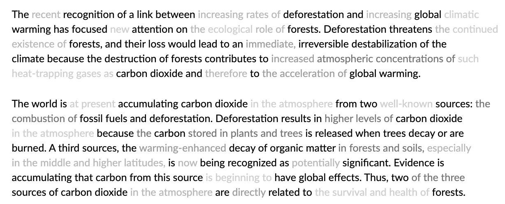

#  Grammar-Preserving Text Saliency Modulation (GP-TSM)
**[An AI-Resilient Text Rendering Technique for Reading and Skimming Documents](https://www.ziweigu.com/assets/data/gptsm.pdf)**  
Ziwei Gu, Ian Arawjo, Kenneth Li, Jonathan K. Kummerfeld, Elena L. Glassman\
In *the 2024 ACM CHI conference on Human Factors in Computing Systems*\
*CHI ’24, May 11–16, 2024, Honolulu, HI, USA* 


**GP-TSM** is an LLM-powered text rendering technique that supports reading and skimming by reifying recursive sentence compression in text saliency. Readers can skip over de-emphasized segments without compromising their reading flow/ comprehension of the text, while still being able to notice and recover from AI suggestions they disagree with.

* Read the **[full paper](https://www.ziweigu.com/assets/data/gptsm.pdf)**.
* Try the live demo **[here](https://gptsm-6b7fc3be6bdb.herokuapp.com/)**.
* For more information, see **[our lab website](https://glassmanlab.seas.harvard.edu/)**.

## Citation
```
@inproceedings{10.1145/3613904.3642699,
author = {Gu, Ziwei and Arawjo, Ian and Li, Kenneth and Kummerfeld, Jonathan K. and Glassman, Elena L.},
title = {An AI-Resilient Text Rendering Technique for Reading and Skimming Documents},
year = {2024},
isbn = {9798400703300},
publisher = {Association for Computing Machinery},
address = {New York, NY, USA},
url = {https://doi.org/10.1145/3613904.3642699},
doi = {10.1145/3613904.3642699},
booktitle = {Proceedings of the CHI Conference on Human Factors in Computing Systems},
articleno = {898},
numpages = {22},
keywords = {human-AI interaction, natural language processing, text visualization},
location = {<conf-loc>, <city>Honolulu</city>, <state>HI</state>, <country>USA</country>, </conf-loc>},
series = {CHI '24}
}
```


In this example we show what it looks like when **GP-TSM** is applied to two paragraphs of text from GRE (The Graduate Record Examinations) Practice Exams. **GP-TSM** uses an LLM-based recursive sentence compression method to identify successive levels of detail beyond the core meaning of a passage, which are de-emphasized by rendering words with successively lighter but still legible gray text.


## Installation

Clone the repository:

```
git clone https://github.com/ZiweiGu/GP-TSM
```

Then, set up the virtual environment (called venv) using virtualenv (installation [here](https://virtualenv.pypa.io/en/latest/installation.html)):
```

virtualenv -p python3 venv 
```

Activate the virtual environment:
```

source venv/bin/activate
```

Install necessary packages:
```

pip install -r requirements.txt
```

## Usage

Run the app (in development mode) with:

```
python3 app.py
```


## Researchers

|  Name                 | Affiliation                     |
|-----------------------|---------------------------------|
| [Ziwei Gu](https://www.ziweigu.com/)           | Harvard University |
| [Ian Arawjo](https://ianarawjo.com/) | Harvard University |
| [Kenneth Li](https://likenneth.github.io/)    | Harvard University |
| [Jonathan K. Kummerfeld](https://jkk.name/) | University of Sydney |
| [Elena L. Glassman](https://glassmanlab.seas.harvard.edu/glassman.html)        | Harvard University |


## License

See [`LICENSE.md`](LICENSE.md).
